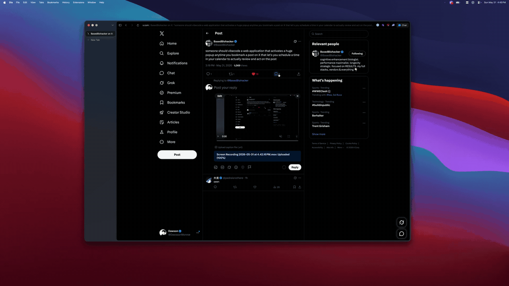

# Bookmark to Calendar

A Chrome extension that turns X bookmarks into a quick reminder prompt.

## Demo

## Install

1. Download `bookmark-to-calendar-v1.0.0.zip` from the [latest release](https://github.com/Dawsson/bookmark-to-calendar/releases/latest).
2. Unzip it.
3. Open `chrome://extensions`.
4. Turn on **Developer mode**.
5. Click **Load unpacked**.
6. Select the unzipped folder.

Or install from source:

1. Clone this repo.
2. Open `chrome://extensions`.
3. Turn on **Developer mode**.
4. Click **Load unpacked**.
5. Select the repo folder.

## Notes

- Runs only on `x.com` and `twitter.com`.
- The repo includes all extension logo assets: `assets/logo.png` and Chrome icons in `icons/`.
- Opens Google Calendar with event details filled in. It does not save events by itself.
- No build step.

Idea: https://x.com/BasedBiohacker/status/2061165566006542575
